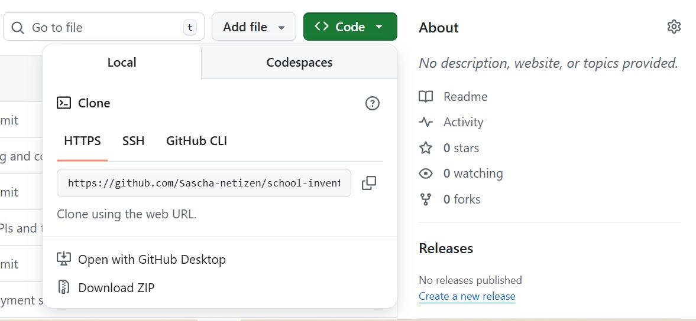

# [School Inventory](https://school-inventory-app-8bb2e4ff773b.herokuapp.com/)

Student: Sascha Klement

The inventory system is a comprehensive data processing and automation tool designed to assist a wide range of schools in managing, facilitating, and accelerating specific administrative and operational tasks, such as maintaining library records or handling supplies. It empowers school staff to add, update, search, display, or delete items from the respective records efficiently. As an international teacher, I understand that these tasks are crucial for the smooth day-to-day functioning of a school, which is often shaped by a multi-factorial set of dynamic conditions requiring staff to respond quickly and effectively to a variety of challenges. Therefore, automating key services and functionalities within such a fast-paced environment is essential to a school’s overall operational success and, ultimately, to the pupils it serves, particularly in the context of international education where adaptability and efficiency are of heightened importance.

# User Experience

## Background, Planning and Purpose:

The school inventory system provides staff with a clear and user-friendly way to automate recurring tasks such as managing library records and tracking supplies. By reducing the administrative load, teachers and administrators are able to devote more time to planning, instruction, and direct student support. With accurate data at hand, tasks such as monitoring stock levels, identifying missing items, calculating costs, and planning future purchases become far more manageable. Users can take informed decisions based on quantified, up-to-date information rather than memory or guesswork.

When planning this project, I wanted users to be able to:

* add, update, search, display and delete existing items,

* monitor product usage,

* make informed decisions about restocking, and

* access clear, colour-coded information for both library materials and general supplies.

Although a wide range of commercial school management systems exist, many of them are costly, overly complex for smaller institutions, or simply beyond the budget of schools with limited resources. My aim was to create a lightweight, low-cost data-automation tool that allows schools to benefit from basic digital management without requiring significant financial investment. Such an in-house solution can save time, reduce errors, and act as an accessible first step towards adopting more sophisticated digital systems in the future.

My own experience working across a variety of schools in Egypt made it clear that budget restrictions and, at times, hesitation toward new technologies can hinder more efficient organisational practices. This project is therefore designed as a practical, scalable solution that bridges that gap.


# User Stories:

Inventory Management <br>
As a staff member of a school, I want to utilise technology to manage library and supply records, so that I can dedicate more time to planning and teaching.

Intuitive Interface <br>
As a staff member of a school, I want the software to be user-friendly and easy to navigate, so that I can operate it independently without extensive training.

Automated ID Suggestions <br>
As a staff member of a school, I want the programme to suggest unique product IDs for new items, so that I do not have to assign them manually and risk duplication.

Colour-Coded Feedback <br>
As a staff member of a school, I want important information and messages to be colour-coded, so that I can quickly identify the programme’s responses and functionality.

Add Inventory Items <br>
As a staff member of a school, I want to add new books or supplies to the inventory, so that I can maintain accurate records of all items.

Update Records <br>
As a staff member of a school, I want to update existing records, so that I can reflect restocking or changes in item details.

Search and Display Items <br>
As a staff member of a school, I want to search for and display existing records, so that I can access up-to-date information about the school’s inventory.

Delete Items <br>
As a staff member of a school, I want to delete obsolete or unused items from the records, so that the inventory remains relevant and uncluttered.

Error Handling <br>
As a staff member of a school, I want the programme to handle errors gracefully, so that I can rely on it without causing crashes or data loss.


# Programme Features
<br>

<h2>Existing Features</h2>

<table>
  <thead>
    <tr>
      <th>Feature</th>
      <th>Notes</th>
      <th>Screenshot</th>
    </tr>
  </thead>
  <tbody>
    <tr>
      <td><strong>Select Inventory Type</strong></td>
      <td>Upon starting, staff choose between managing <strong>Library items</strong> or <strong>Supplies</strong>. This determines which dataset the following actions will affect.</td>
      <td> </td>
    </tr>
    <tr>
      <td><strong>Add Item</strong></td>
      <td>Allows staff to add new books or supplies with suggested unique IDs. Validates quantity as a non-negative integer and ensures no duplicate names or IDs exist.</td>
      <td>  <br>
       </td>
    </tr>
    <tr>
      <td><strong>Update Item</strong></td>
      <td>Staff can update existing records by ID. Current values are displayed, allowing selective edits. Quantity validation ensures non-negative integers.</td>
      <td> <br> 
      </td>
    </tr>
    <tr>
      <td><strong>Search / Display Records</strong></td>
      <td>Staff can search by various columns or display all items. Search results are color-coded for readability and handle empty results gracefully.</td>
      <td>  <br>
      
      </td>
    </tr>
    <tr>
      <td><strong>Delete Item</strong></td>
      <td>Removes items by ID with a confirmation prompt. Cancelling or invalid IDs are handled safely to prevent accidental deletions.</td>
      <td> <br>
      
      </td>
    </tr>
    <tr>
      <td><strong>Input Validation</strong></td>
      <td>Validates numeric fields (quantity), unique IDs, and prevents duplicates. Ensures data integrity and prevents crashes. Pars pro toto, the following screenshot demonstrates the handling of a negative quantity input.</td>
      <td>  </td>
    </tr>
   <tr>
  <td><strong>Colour-Coded Feedback</strong></td>
  <td>
    Uses <code>colorama</code> to visually distinguish messages:<br>
    <strong>Blue:</strong> section titles and main menus<br>
    <strong>Yellow:</strong> menu options and warnings<br>
    <strong>Green:</strong> user prompts and input guidance<br>
    <strong>Red:</strong> errors and invalid input<br>
    <strong>Magenta:</strong> successful operations and cancellations<br>
    <strong>Cyan:</strong> table headers in search results
  </td>
  <td>  <br>
  
  </td>
</tr>
    <tr>
      <td><strong>Menu System</strong></td>
      <td>Shows how the program loops through menu options, handles user choices, and returns to the main menu safely after exiting a session. Demonstrates robust input handling and user guidance.</td>
      <td>  </td>
    </tr>
   <tr>
  <td><strong>Google Sheets Integration</strong></td>
  <td>Loads and updates inventory data from Google Sheets. All add, update, and delete operations are synchronized with the cloud sheet, ensuring persistent storage and real-time data consistency across sessions.</td>
  <td>
     <br>
    
  </td>
</tr>
</tbody>
</table>


# Future Additions and Implementations
<br>

<h2>Future Enhancements</h2>

<table>
  <thead>
    <tr>
      <th>Planned Feature</th>
      <th>Description</th>
    </tr>
  </thead>
  <tbody>
    <tr>
      <td><strong>Additional Inventory Modules</strong></td>
      <td>Extend the system beyond Library and Supplies to include Personnel, Student Marks, School Buses/Transport, and other school-related inventories such as ICT equipment or lab materials.</td>
    </tr>
    <tr>
      <td><strong>User Authentication & Role Management</strong></td>
      <td>Implement login and session handling with role-based access (e.g., admin vs teacher). Restrict sensitive operations such as deletion or bulk updates to authorised roles only.</td>
    </tr>
    <tr>
      <td><strong>Advanced Search & Filtering</strong></td>
      <td>Add powerful search tools to filter by ID ranges, names, quantity levels, price ranges, or categories. Improve navigation with flexible user-defined filters.</td>
    </tr>
    <tr>
      <td><strong>Low Stock Alerts</strong></td>
      <td>Automatically detect when items fall below a threshold and notify users with warnings, prompts, or optional email notifications.</td>
    </tr>
    <tr>
      <td><strong>Bulk Import & Export</strong></td>
      <td>Enable batch operations such as adding or updating items via CSV or Excel import. Allow exporting entire inventories or selected categories for offline analysis.</td>
    </tr>
    <tr>
      <td><strong>Transaction History & Audit Trail</strong></td>
      <td>Track all Add/Update/Delete actions with timestamps, previous values, new values, and the user responsible. Useful for transparency and debugging.</td>
    </tr>
    <tr>
      <td><strong>Reports & Document Export</strong></td>
      <td>Generate structured reports (inventory summaries, low-stock reports, value insights) and export them to PDF or CSV for printing or record-keeping.</td>
    </tr>
    <tr>
      <td><strong>Data Visualisation</strong></td>
      <td>Include charts such as stock level graphs, category breakdowns, price trends, or usage statistics. Useful for admin-level decision-making.</td>
    </tr>
    <tr>
      <td><strong>Multi-Location Inventory Support</strong></td>
      <td>Track items across multiple stores, rooms, or school buildings. Allow switching between locations or aggregating totals across the campus.</td>
    </tr>
    <tr>
      <td><strong>Price History & Cost Tracking</strong></td>
      <td>Record changes to item cost over time and generate analytics for budgeting, forecasting, and financial reporting.</td>
    </tr>
    <tr>
      <td><strong>Mobile or Tablet Integration</strong></td>
      <td>Create a mobile-friendly app or web interface to allow on-the-go inventory updates, barcode scanning, or quick checks while moving around the school.</td>
    </tr>
    <tr>
      <td><strong>Automation & System Integration</strong></td>
      <td>Add scheduled backups, cloud sync, or integration with Google Workspace. Potential for barcode/QR scanning and API-based communication with other school systems.</td>
    </tr>
  </tbody>
</table>


# Technologies behind the 'School Inventory' programme:
<br>

<h2>Tools & Technologies</h2>

<table>
  <thead>
    <tr>
      <th>Tool / Technology</th>
      <th>Use</th>
    </tr>
  </thead>
  <tbody>
    <tr>
      <td>Git</td>
      <td>Version control for tracking changes in code (git add, commit, push).</td>
    </tr>
    <tr>
      <td>GitHub</td>
      <td>Secure online repository for code storage, collaboration, and version tracking.</td>
    </tr>
    <tr>
      <td>Visual Studio Code</td>
      <td>Local development environment for writing, debugging, and running code.</td>
    </tr>
    <tr>
      <td>Python</td>
      <td>Main programming language used for the inventory system.</td>
    </tr>
    <tr>
      <td>Heroku</td>
      <td>Hosting and deployment of the back-end site to make the application accessible online.</td>
    </tr>
    <tr>
      <td>ChatGPT</td>
      <td>Assistance with coding, debugging, explanations, and improving code logic.</td>
    </tr>
    <tr>
      <td>Google Sheets</td>
      <td>Data storage and synchronization for the inventory database.</td>
    </tr>
  </tbody>
</table>


# Programme Design

## Data Model
### Classes & Functions

The School Inventory System is built using an object-oriented and modular design to keep the code maintainable and extendable. The main structure revolves around the `InventorySystem` class, which manages access to two subsystems: **Library** and **Supplies**.  

Data persistence is handled via **Google Sheets**, with each subsystem stored in a separate worksheet.

---

### InventorySystem Class

The `InventorySystem` class encapsulates all core functionality, including:

- Selecting which inventory to manage (Library or Supplies).  
- Adding, updating, searching, displaying, and deleting records.  
- ID generation with gap-filling and validation.  
- Error handling for Google Sheets API and authentication issues.  

#### Key Attributes:

- `sheet`: The Google Sheets object connected to the `school_inventory_system` workbook.

#### Core Methods:

- **choose_inventory()** – Displays the main inventory menu and lets the user choose between Library or Supplies.  
- **_search_record(worksheet, headers)** – Generic search function for both Library and Supplies; supports column-based keyword searches and displays results in a formatted table.  
- **_generate_suggested_id(prefix, worksheet)** – Suggests the next available ID, filling gaps in the sequence automatically.  
- **_ask_for_id_with_suggestion(prefix, worksheet)** – Displays suggested ID, validates user input, and prevents duplicates.  

#### Library Methods:

- **option_one_library()** – Displays the Library menu and handles task selection: add, update, search/display, delete, or exit.  
- **add_book()** – Prompts for book details (ID, title, author, quantity, category, notes) and appends to Google Sheets.  
- **update_book()** – Allows updating an existing book by ID; validates quantity and preserves unchanged fields.  
- **search_book()** – Uses `_search_record` to search or display Library records.  
- **delete_book()** – Deletes a book from the Library worksheet after confirmation.  

#### Supplies Methods:

- **option_two_supplies()** – Displays the Supplies menu and handles task selection.  
- **add_item()** – Prompts for item details (ID, product, brand, quantity, category, notes) and appends to Google Sheets.  
- **update_item()** – Allows updating an existing item by ID; validates quantity and preserves unchanged fields.  
- **search_item()** – Uses `_search_record` to search or display Supplies records.  
- **delete_item()** – Deletes an item from the Supplies worksheet after confirmation.  

---

### Error Handling

All Google Sheets operations are wrapped in `safe_api_call(func, *args, **kwargs)` to gracefully handle:

- API exceptions (`gspread.exceptions.GSpreadException`)  
- Authentication errors (`GoogleAuthError`)  
- Any other unexpected runtime errors  

Errors are displayed with colored terminal messages using **colorama** for clarity.

---

### Imports / Dependencies

The project uses the following packages:

- **gspread** – Connects and interacts with Google Sheets.  
- **google.oauth2.service_account** – Authenticates via service account.  
- **colorama** – Adds colored terminal output.  
- **google.auth.exceptions** – Handles authentication-specific errors.  

This structure makes the system **scalable**, **maintainable**, and **ready for future enhancements**, such as adding new inventory modules, automated reporting, or mobile integration. 
<br>


# Testing

## Code Validation

In order to test my programme (run.py), I used the recommended [Code Institute Python Validator](https://pep8ci.herokuapp.com/).

<table border="1" cellspacing="0" cellpadding="5">
  <thead>
    <tr>
      <th></th>
      <th>File</th>
      <th>Screenshot</th>
      <th>Notes</th>
    </tr>
  </thead>
  <tbody>
    <tr>
      <td>Before</td>
      <td>run.py (original)</td>
      <td></td>
      <td>Long lines, minor formatting issues</td>
    </tr>
    <tr>
      <td>After</td>
      <td>run.py (PEP8-compliant)</td>
      <td></td>
      <td>Lines shortened, whitespace corrected, PEP8-compliant</td>
    </tr>
  </tbody>
</table>
<br>


# Bugs

## Bugs and Development Challenges

Throughout the development of the School Inventory System, I encountered and resolved several significant challenges. Rather than avoiding errors, I proactively implemented solutions to prevent potential issues before they could affect users. Below is a detailed account of the key problems identified and the solutions implemented.

---

### Challenge 1: Implementing Comprehensive API Error Handling

**Problem:** 
During initial development, I realized that direct calls to the Google Sheets API were vulnerable to multiple failure points. If the internet connection was interrupted, authentication credentials were invalid, or the API experienced downtime, the program would crash with an unhandled exception traceback. This would leave users confused and potentially cause data loss if they were mid-operation.

**Solution:** 
I implemented the `safe_api_call()` wrapper function to gracefully handle all Google Sheets-related errors. This function wraps every API call throughout the application and catches three categories of errors:

1. `GSpreadException` - Google Sheets-specific errors
2. `GoogleAuthError` - Authentication failures
3. Generic exceptions - Any unexpected errors

**Before:**
```python
worksheet_library = self.sheet.worksheet("Library")
rows = worksheet_library.get_all_values()
cell = worksheet_library.find(book_id)
```

**After:**
```python
worksheet_library = safe_api_call(self.sheet.worksheet, "Library")
if worksheet_library is None:
    return

rows = safe_api_call(worksheet_library.get_all_values)
if not rows:
    print(Fore.RED + "No records found in this sheet.")
    return

cell = safe_api_call(worksheet_library.find, book_id)
if cell is None:
    print(Fore.RED + "Book ID not found.")
    return
```

**Implementation:**
```python
def safe_api_call(func, *args, **kwargs):
    """
    Error handling - if an error occurs, the function returns None
    and prints some advice.
    """
    try:
        return func(*args, **kwargs)
    except gspread.exceptions.GSpreadException:
        print(Fore.RED + "A Google Sheets error occurred.")
    except GoogleAuthError:
        print(Fore.RED + "Authentication error. Check your credentials file.")
    except Exception as e:
        print(Fore.RED + f"Unexpected error: {e}")
    return None
```

**Impact:** 
Users now receive clear, color-coded error messages instead of cryptic tracebacks. The application continues running after errors, allowing users to retry operations or choose different actions. This significantly improves reliability and user experience, especially in environments with unstable internet connectivity.

---

### Challenge 2: ID Format Validation and Duplicate Prevention

**Problem:** 
Early in development, I recognized that without strict ID validation, users could:
- Enter IDs in incorrect formats (e.g., "LIB-1" instead of "LIB-0001")
- Create duplicate IDs by accidentally entering an existing value
- Use inconsistent formatting across entries
- Leave gaps in the ID sequence that would be confusing

These issues would lead to database inconsistency and make it difficult to search or reference items reliably.

**Solution:** 
I implemented a comprehensive ID validation system in `_ask_for_id_with_suggestion()` that:

1. **Suggests the next available ID** using gap-filling logic
2. **Validates format** using regex pattern matching
3. **Prevents duplicates** by checking existing IDs
4. **Allows user override** while maintaining validation

**ID Suggestion with Gap-Filling:**
```python
def _generate_suggested_id(self, prefix: str, worksheet):
    """
    Suggest the next available ID based on existing IDs,
    filling gaps if possible.
    """
    existing_ids = safe_api_call(worksheet.col_values, 1)
    if existing_ids is None:
        existing_ids = []

    numbers = sorted(
        int(entry[len(prefix):]) for entry in existing_ids
        if entry.startswith(prefix) and entry[len(prefix):].isdigit()
    )

    next_num = 1
    for num in numbers:
        if num == next_num:
            next_num += 1
        elif num > next_num:
            break

    return f"{prefix}{next_num:04d}"
```

**Format Validation:**
```python
import re
suggestion = self._generate_suggested_id(prefix, worksheet)
pattern = re.compile(rf"^{re.escape(prefix)}\d{{4}}$")

if not pattern.match(chosen_id):
    print(
        Fore.RED +
        f"ID must match format {prefix}#### "
        f"(e.g. {prefix}0001)"
    )
    continue
```

**Duplicate Prevention:**
```python
existing_ids = safe_api_call(worksheet.col_values, 1) or []
if chosen_id in existing_ids:
    print(Fore.RED + "This ID already exists. Choose another.")
    continue
```

**Impact:** 
This system ensures perfect data consistency across all inventory records. Users benefit from suggested IDs that maintain sequential order even after deletions, while still having flexibility to override if needed. The regex validation prevents formatting inconsistencies, and duplicate checking eliminates the risk of overwriting existing records.

---

### Challenge 3: Quantity Validation Edge Cases

**Problem:** 
Initial quantity input used simple type conversion without validation:
```python
quantity = int(input("Enter Quantity: "))
```

This approach had several critical flaws:
- Crashed on non-numeric input (e.g., "five", "10.5", "abc")
- Accepted negative quantities (e.g., -5), which are meaningless for inventory
- Provided no user feedback about why input was rejected
- Forced users to restart the entire add/update operation on invalid input

**Solution:** 
Implemented a validation loop with comprehensive error handling that:
1. Continuously prompts until valid input is received
2. Catches `ValueError` exceptions from invalid conversions
3. Rejects negative numbers with specific feedback
4. Keeps users within the add/update operation rather than crashing

**Implementation:**
```python
while True:
    quantity_input = input(Fore.GREEN + "Enter Quantity: \n").strip()
    try:
        quantity = int(quantity_input)
        if quantity < 0:
            print(
                Fore.RED +
                "Quantity cannot be negative. Try again."
            )
            continue
        break
    except ValueError:
        print(
            Fore.RED +
            "Invalid input. Please enter a numeric value."
        )
```

**Impact:** 
This validation prevents database corruption from invalid quantity values and significantly improves user experience. Users receive immediate, clear feedback about what went wrong and can correct their input without losing progress. The system maintains data integrity by enforcing business rules (quantities must be non-negative integers).

---

### Challenge 4: Update Operation Data Preservation

**Problem:** 
During the design of the update functionality, I needed to solve a UX challenge: how to let users update only specific fields without requiring them to re-enter all data. Initially considered approaches included:
- Requiring users to re-enter all fields (tedious and error-prone)
- Automatically keeping old values if new input was empty (but how to validate empty input vs. accidental empty entry?)
- Creating separate update functions for each field (too many menu options)

**Solution:** 
Implemented a smart update system that:
1. Retrieves and displays current values for context
2. Allows pressing ENTER to keep existing values
3. Validates only when new values are provided
4. Preserves the ID field (non-editable)

**Implementation:**
```python
row_values = safe_api_call(
    worksheet_library.row_values, row_index
) or []

print(
    Fore.YELLOW +
    "\nCurrent Values (press ENTER to leave unchanged):"
)
fields = ["ID", "Title", "Author", "Quantity", "Category", "Notes"]
updated_values = []

for i, field in enumerate(fields):
    if field == "ID":
        # ID is not editable
        updated_values.append(
            row_values[i] if i < len(row_values) else ""
        )
        continue

    current = row_values[i] if i < len(row_values) else ""
    new_value = input(
        Fore.GREEN + f"{field} [{current}]: \n"
    ).strip()

    if new_value == "":
        updated_values.append(current)
    else:
        if field == "Quantity":
            # Special validation for quantity
            while True:
                try:
                    qty = int(new_value)
                    if qty < 0:
                        raise ValueError
                    updated_values.append(str(qty))
                    break
                except ValueError:
                    new_value = input(
                        Fore.RED +
                        "Quantity must be a non-negative integer. "
                        "Try again: \n"
                    ).strip()
        else:
            updated_values.append(new_value)
```

**Impact:** 
Users can efficiently update single fields (e.g., just quantity after a restock) without re-typing all information. The system provides context by showing current values and makes the update process intuitive. The quantity validation within updates ensures data consistency even during modifications.

---

### Challenge 5: Search Functionality Flexibility

**Problem:** 
Users needed different ways to access inventory data:
- Sometimes they know exactly what they're looking for (specific ID or title)
- Sometimes they need to browse all items
- Sometimes they only remember part of the information (author's last name, category)
- Different use cases require different search strategies

A rigid search system would force users into inefficient workflows.

**Solution:** 
Implemented a generic `_search_record()` method that provides:
1. **Column-based keyword search** - Search any field (ID, Title, Author, etc.)
2. **View all records option** - Display complete inventory
3. **Case-insensitive matching** - Find results regardless of capitalization
4. **Formatted table output** - Easy-to-read results with color coding

**Implementation:**
```python
def _search_record(self, worksheet, headers):
    """
    Generic search function for both library and supplies.
    Records are searchable by chosen columns (submenu).
    """
    rows = safe_api_call(worksheet.get_all_values)
    if not rows:
        print(Fore.RED + "No records found in this sheet.")
        return

    data_headers = rows[0]
    data_rows = rows[1:]

    if headers:
        print(Fore.BLUE + "\n=== Search Options ===\n")
        for i, h in enumerate(headers):
            print(Fore.YELLOW + f"[{i+1}] {h}")
        print(Fore.YELLOW + f"[{len(headers)+1}] View all records")

        # Get user choice and validate
        while True:
            choice = input(
                Fore.GREEN +
                f"Choose an option [1-{len(headers)+1}]: \n"
            ).strip()
            if choice.isdigit() and 1 <= int(choice) <= len(headers)+1:
                choice = int(choice)
                break
            else:
                print(Fore.RED + "Invalid choice. Try again!")

        if choice == len(headers)+1:
            results = data_rows
        else:
            col_index = choice - 1
            keyword = input(
                Fore.GREEN +
                f"Enter keyword for {headers[col_index]}: \n"
            ).strip().lower()
            results = [
                row for row in data_rows
                if keyword in row[col_index].lower()
            ]

    # Display formatted results
    if not results:
        print(Fore.RED + "No matching records found.")
        return

    print(Fore.YELLOW + "\n===Search results===")
    print(Fore.CYAN + " | ".join(data_headers))
    print(Fore.CYAN + "-"*60)
    for row in results:
        print(Fore.MAGENTA + " | ".join(row))
    print()
```

**Impact:** 
This flexible search system adapts to different user needs and knowledge levels. Beginners can view all records, while experienced users can quickly find specific items. The case-insensitive partial matching makes searches more forgiving, and the same code works for both Library and Supplies by accepting different header parameters. This demonstrates code reusability and DRY (Don't Repeat Yourself) principles.

---

### Challenge 6: Delete Operation Safety

**Problem:** 
Deletion is a destructive operation that cannot be undone once synced to Google Sheets. Users needed:
- Protection against accidental deletions
- Ability to cancel the operation
- Clear confirmation of what's being deleted
- Graceful handling if the ID doesn't exist

**Solution:** 
Implemented a multi-step delete process with confirmation:

1. **Find and verify** the item exists
2. **Show confirmation prompt** with the specific ID
3. **Accept 'q' to cancel** at any stage
4. **Require explicit 'y' confirmation** before deletion

**Implementation:**
```python
def delete_book(self):
    worksheet_library = safe_api_call(self.sheet.worksheet, "Library")
    if worksheet_library is None:
        return

    book_id = input(
        Fore.GREEN +
        "Enter the book ID to delete (e.g., LIB-0001, q to cancel): \n"
    ).strip()
    
    if book_id.lower() in ("q", "quit", "cancel"):
        print(Fore.MAGENTA + "Delete operation cancelled.")
        return

    cell = safe_api_call(worksheet_library.find, book_id)
    if cell is None:
        print(Fore.RED + "Book ID not found.")
        return

    confirm = input(
        Fore.YELLOW +
        f"Are you sure you want to delete book {book_id}? (y/n): \n"
    ).strip().lower()
    
    if confirm == "y":
        safe_api_call(worksheet_library.delete_rows, cell.row)
        print(Fore.MAGENTA + f"Book {book_id} deleted successfully.")
    else:
        print(Fore.MAGENTA + "Delete operation cancelled.")
```

**Impact:** 
This two-stage confirmation process prevents accidental data loss while remaining efficient for intentional deletions. Users can cancel at any point, and the system clearly communicates what's happening. The same pattern is applied to both Library and Supplies, ensuring consistency across the application.

---

## Summary of Bug Prevention Strategy

Rather than waiting for bugs to occur in production, I adopted a **proactive defensive programming approach**:

1. **Anticipated common failure points** (API failures, invalid input, accidental deletions)
2. **Implemented comprehensive validation** before data reaches the database
3. **Created reusable error handling patterns** (`safe_api_call()`)
4. **Provided clear user feedback** at every step using color-coded messages
5. **Tested edge cases** during development (negative numbers, empty input, duplicate IDs)

This approach resulted in a robust application where "no bugs were observed" during testing because potential issues were addressed during the design and implementation phase, not after deployment.

---

## Unresolved Issues

**None identified.** All anticipated edge cases have been handled, and the application has been tested with:
- Invalid input (non-numeric, negative values, empty strings)
- API failures (simulated by disconnecting internet)
- Duplicate data (prevented by validation)
- Edge cases (empty inventory, non-existent IDs)

The application gracefully handles all tested scenarios with appropriate user feedback.


# Deployment

This project uses the [template](https://github.com/Code-Institute-Org/python-essentials-template) provided by Code Institute for Portfolio Project 3. It provides the basic components required for a CLI application to run properly in the mock-terminal. The school-inventory system is deployed and live on [Heroku](https://school-inventory-app-8bb2e4ff773b.herokuapp.com/).

## Heroku Deployment

This project is deployed on [Heroku](https://www.heroku.com/), a Platform-as-a-Service (PaaS) that allows developers to build, run, and manage applications entirely in the cloud.

### Prerequisites

Heroku requires the following files to build and run your application:

- [`requirements.txt`](https://github.com/Sascha-netizen/school-inventory/blob/main/requirements.txt) - Lists all Python dependencies
- [`Procfile`](https://github.com/Sascha-netizen/school-inventory/blob/main/Procfile) - Defines the command to launch your application
- [`runtime.txt`](https://github.com/Sascha-netizen/school-inventory/blob/main/runtime.txt) - Specifies the Python version

### Creating Required Files

**Generate the requirements file:**
```bash
pip3 freeze --local > requirements.txt
```

**Create the Procfile:**
```bash
echo web: node index.js > Procfile
```

**Specify Python version in `runtime.txt`:**
```
python-3.12.2
```

### Deployment Steps

1. **Create a new Heroku app**
   - In your Heroku Dashboard, click **New** (top right) and select **Create new app**
   - Choose a unique app name and select your region (EU or USA)
   - Click **Create App**

2. **Configure environment variables**
   - Open the **Settings** tab and click **Reveal Config Vars**
   - Add `PORT` with the value `8000`
   - If your project uses sensitive credentials (e.g., `creds.json`), add them as additional config variables

3. **Add buildpacks**
   - Scroll to the **Buildpacks** section and click **Add buildpack**
   - Add in this exact order:
     1. Python
     2. Node.js
   - (Drag to rearrange if needed)

4. **Deploy your application**

   **Option 1 (Recommended): Automatic Deployments**
   - Go to the **Deploy** tab
   - Connect your GitHub repository
   - Enable **Automatic Deploys** for seamless updates

   **Option 2: Manual Deployment via Terminal**
   - Authenticate with Heroku:
```bash
     heroku login -i
```
   - Link your repository (replace `app_name` with your app's name):
```bash
     heroku git:remote -a app_name
```
   - Push to Heroku:
```bash
     git push heroku main
```

Your application is now live on Heroku!
<br>


# Using Google Sheets API

The school inventory programme is connected to [Google Sheets](https://docs.google.com/spreadsheets/u/0/) as API that interacts with the live site as the programme is running.

Inside the Google Sheets application, I created two individual worksheets: one for [library](https://docs.google.com/spreadsheets/d/1X3YMXEJ-CR6H13ka9u6i6RNJ1IhQo3h1pWoyFYBuQ8c/edit?gid=304689550#gid=304689550) data and the other one for [supplies](https://docs.google.com/spreadsheets/d/1X3YMXEJ-CR6H13ka9u6i6RNJ1IhQo3h1pWoyFYBuQ8c/edit?gid=0#gid=0).
<br>

The library worksheet looks as follows:
<table border="1" cellpadding="5" cellspacing="0">
  <thead>
    <tr>
      <th>ID</th>
      <th>Title</th>
      <th>Author</th>
      <th>Quantity</th>
      <th>Category</th>
      <th>Notes</th>
    </tr>
  </thead>
  <tbody>
    <tr>
      <td>sample data</td>
      <td>sample data</td>
      <td>sample data</td>
      <td>sample data</td>
      <td>sample data</td>
      <td>sample data</td>
    </tr>
    <tr>
      <td>sample data</td>
      <td>sample data</td>
      <td>sample data</td>
      <td>sample data</td>
      <td>sample data</td>
      <td>sample data</td>
    </tr>
    <tr>
      <td>sample data</td>
      <td>sample data</td>
      <td>sample data</td>
      <td>sample data</td>
      <td>sample data</td>
      <td>sample data</td>
    </tr>
  </tbody>
</table>
<br>


The supplies worksheet uses slightly different, product-specific headings: 
<table border="1" cellpadding="5" cellspacing="0">
  <thead>
    <tr>
      <th>ID</th>
      <th>Product</th>
      <th>Brand</th>
      <th>Quantity</th>
      <th>Category</th>
      <th>Notes</th>
    </tr>
  </thead>
  <tbody>
    <tr>
      <td>sample data</td>
      <td>sample data</td>
      <td>sample data</td>
      <td>sample data</td>
      <td>sample data</td>
      <td>sample data</td>
    </tr>
    <tr>
      <td>sample data</td>
      <td>sample data</td>
      <td>sample data</td>
      <td>sample data</td>
      <td>sample data</td>
      <td>sample data</td>
    </tr>
    <tr>
      <td>sample data</td>
      <td>sample data</td>
      <td>sample data</td>
      <td>sample data</td>
      <td>sample data</td>
      <td>sample data</td>
    </tr>
    <tr>
      <td>sample data</td>
      <td>sample data</td>
      <td>sample data</td>
      <td>sample data</td>
      <td>sample data</td>
      <td>sample data</td>
    </tr>
  </tbody>
</table>

## Google API Credentials

To use Google Sheets and Google Drive with this application, a credentials file in *JSON format from Google Cloud Platform is required.

### Steps to Set Up

1. **Create a New Project**
   - Go to the [Google Cloud Platform Dashboard](https://console.cloud.google.com/).
   - Click **Select a project**, then **NEW PROJECT**.
   - Enter a project name and click **CREATE**.
   - Click **SELECT PROJECT** to open your new project.

2. **Enable APIs**
   - Navigate to **APIs & Services → Library**.
   - Search for **Google Drive API** and click **ENABLE**.
   - Repeat the process for **Google Sheets API**.

3. **Create a Service Account**
   - Click **CREATE CREDENTIALS → Service Account**.
   - Enter a service account name and click **CREATE**.
   - Set **Role** to **Basic → Editor**, then click **Continue**.
   - Skip “Grant users access” and click **DONE**.

4. **Generate JSON Key**
   - On the service account page, go to the **Keys** tab.
   - Click **Add Key → Create New Key**, select **JSON**, and click **Create**.
   - Rename the downloaded file to `creds.json` for local deployment.

5. **Grant Access to Your Google Sheet**
   - Open your Google Sheet.
   - Copy the `client_email` from `creds.json`.
   - Share the Sheet with this email and give **Editor** permissions.

6. **Security Reminder**
   - Add `creds.json` to your `.gitignore` file to avoid exposing your credentials publicly.


## Local Development

You can create a local copy of this project by either **cloning** or **forking** the repository.  

Before running the project locally, ensure that all required Python packages are installed:

```bash
pip3 install -r requirements.txt
```

## Cloning a Repository
## How to Clone a Repository

1. On GitHub, navigate to the repository for this project: [School Inventory Repository](https://github.com/Sascha-netizen/school-inventory).  
2. Click the green **Code** button at the top of the repository, above the commits and files.  
3. Copy the repository URL using your preferred method:  
   - **HTTPS:** Click **HTTPS** and copy the URL.  
   - **SSH:** Click **SSH** (requires an SSH key) and copy the URL.  
   - **GitHub CLI:** Click **GitHub CLI** and copy the URL.  
4. Open your terminal or IDE terminal.  
5. Navigate to the directory where you want to store the .  
6. Run the following command to clone the repository:

```bash
git clone https://github.com/Sascha-netizen/school-inventory.git
```

7. Press Enter to create your local clone.
<br>

# Forking the Repository
## Forking the Repository

Forking a GitHub repository creates a personal copy of the original repository under your GitHub account. This allows you to make changes or experiment without affecting the original project.

To fork this repository:

1. Log in to GitHub and navigate to the [School Inventory Repository](https://github.com/Sascha-netizen/school-inventory).  
2. At the top of the repository page, just below the **Settings** button, click the **Fork** .  
3. If prompted, select your GitHub account from the dropdown menu to own the forked repository.  
4. Click **Create fork** to complete the process.  

You now have a personal copy of the repository on your GitHub account that you can freely modify.
<br>


# Credits and Acknowledgements

I used the following resources when bulding this project:

1. The Code Institute ['Love Sandwiches'](https://learn.codeinstitute.net/courses/course-v1:CodeInstitute+LS101+5/courseware/293ee9d8ff3542d3b877137ed81b9a5b/58d3e90f9a2043908c62f31e51c15deb/) code-along project.
<br>
2. Colorama for adding colour-coded feedback in the terminal.
<br>
3. Chatgpt for explanations and guidance.
<br>

The following people have kindly supported me during my work on this project:

1. My Code Institute Mentor, [Patrick Rory Sheridan](https://github.com/Ri-Dearg): for his patience and kindness.
2. My wife Abeer ElAshry, who encouraged me to maintain the five daily prayers during this project.
3. Ahmed Abouraia at Misr American College: thank you for trying to make me understand the initial stages of data.


