# school inventory (Link will follow)

Student: Sascha Klement

The inventory system is a comprehensive data processing and automation tool designed to assist a wide range of schools in managing, facilitating, and accelerating specific administrative and operational tasks, such as maintaining library records or handling supplies. It empowers school staff to add, update, search, display, or delete items from the respective records efficiently. As an international teacher, I understand that these tasks are crucial for the smooth day-to-day functioning of a school, which is often shaped by a multi-factorial set of dynamic conditions requiring staff to respond quickly and effectively to a variety of challenges. Therefore, automating key services and functionalities within such a fast-paced environment is essential to a school’s overall operational success and, ultimately, to the pupils it serves, particularly in the context of international education where adaptability and efficiency are of heightened importance.

# User Experience

## Background, Planning and Purpose:

The school inventory system provides staff with a clear and user-friendly way to automate recurring tasks such as managing library records and tracking supplies. By reducing the administrative load, teachers and administrators are able to devote more time to planning, instruction, and direct student support. With accurate data at hand, tasks such as monitoring stock levels, identifying missing items, calculating costs, and planning future purchases become far more manageable. Users can take informed decisions based on quantified, up-to-date information rather than memory or guesswork.

When planning this project, I wanted users to be able to:

* add, update, search, display and delete existing items,

* monitor product usage,

* make informed decisions about restocking, and

* access clear, colour-coded information for both library materials and general supplies.

Although a wide range of commercial school management systems exist, many of them are costly, overly complex for smaller institutions, or simply beyond the budget of schools with limited resources. My aim was to create a lightweight, low-cost data-automation tool that allows schools to benefit from basic digital management without requiring significant financial investment. Such an in-house solution can save time, reduce errors, and act as an accessible first step towards adopting more sophisticated digital systems in the future.

My own experience working across a variety of schools in Egypt made it clear that budget restrictions and, at times, hesitation toward new technologies can hinder more efficient organisational practices. This project is therefore designed as a practical, scalable solution that bridges that gap.

# User Stories:

Inventory Management  
As a staff member of a school, I want to utilise technology to manage library and supply records, so that I can dedicate more time to planning and teaching.

Intuitive Interface  
As a staff member of a school, I want the software to be user-friendly and easy to navigate, so that I can operate it independently without extensive training.

Automated ID Suggestions  
As a staff member of a school, I want the programme to suggest unique product IDs for new items, so that I do not have to assign them manually and risk duplication.

Colour-Coded Feedback  
As a staff member of a school, I want important information and messages to be colour-coded, so that I can quickly identify the programme’s responses and functionality.

Add Inventory Items  
As a staff member of a school, I want to add new books or supplies to the inventory, so that I can maintain accurate records of all items.

Update Records  
As a staff member of a school, I want to update existing records, so that I can reflect restocking or changes in item details.

Search and Display Items  
As a staff member of a school, I want to search for and display existing records, so that I can access up-to-date information about the school’s inventory.

Delete Items  
As a staff member of a school, I want to delete obsolete or unused items from the records, so that the inventory remains relevant and uncluttered.

Error Handling  
As a staff member of a school, I want the programme to handle errors gracefully, so that I can rely on it without causing crashes or data loss.

# Programme Features
 

<h2>Existing Features</h2>

<table>
  <thead>
    <tr>
      <th>Feature</th>
      <th>Notes</th>
      <th>Screenshot</th>
    </tr>
  </thead>
  <tbody>
    <tr>
      <td><strong>Select Inventory Type</strong></td>
      <td>Upon starting, staff choose between managing <strong>Library items</strong> or <strong>Supplies</strong>. This determines which dataset the following actions will affect.</td>
      <td> 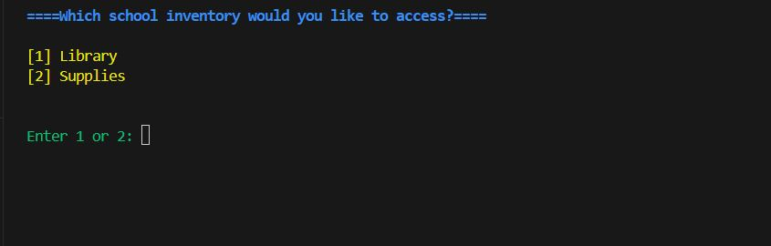</td>
    </tr>
    <tr>
      <td><strong>Add Item</strong></td>
      <td>Allows staff to add new books or supplies with suggested unique IDs. Validates quantity as a non-negative integer and ensures no duplicate names or IDs exist.</td>
      <td> 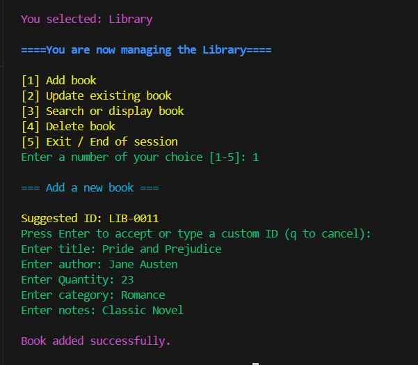  
      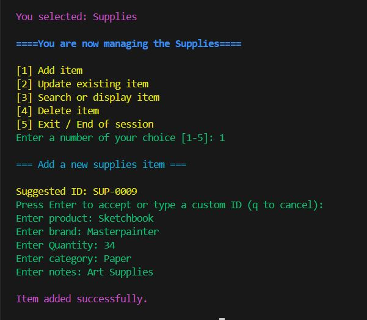 </td>
    </tr>
    <tr>
      <td><strong>Update Item</strong></td>
      <td>Staff can update existing records by ID. Current values are displayed, allowing selective edits. Quantity validation ensures non-negative integers.</td>
      <td> 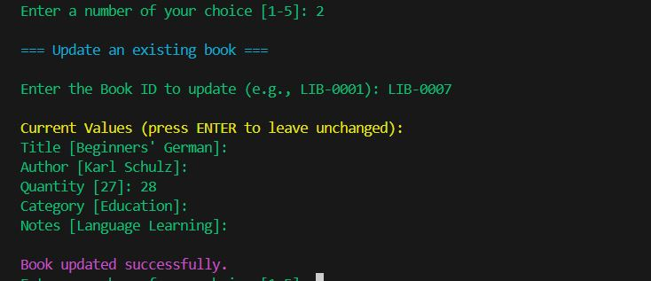  
      </td>
    </tr>
    <tr>
      <td><strong>Search / Display Records</strong></td>
      <td>Staff can search by various columns or display all items. Search results are color-coded for readability and handle empty results gracefully.</td>
      <td>   
      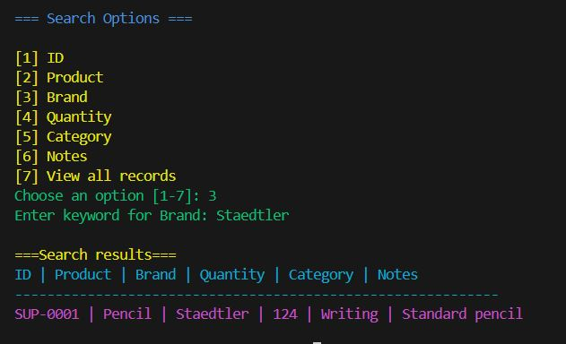
      </td>
    </tr>
    <tr>
      <td><strong>Delete Item</strong></td>
      <td>Removes items by ID with a confirmation prompt. Cancelling or invalid IDs are handled safely to prevent accidental deletions.</td>
      <td> 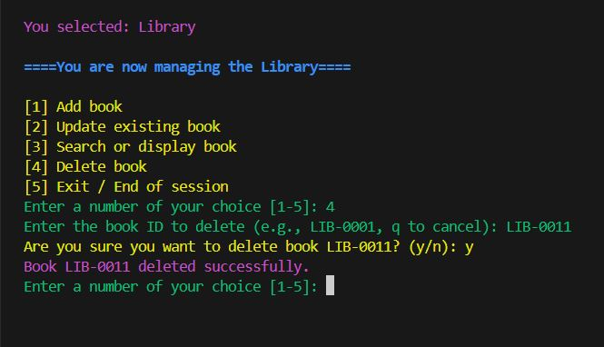 
      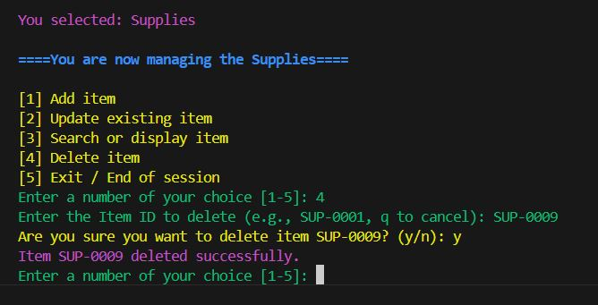
      </td>
    </tr>
    <tr>
      <td><strong>Input Validation</strong></td>
      <td>Validates numeric fields (quantity), unique IDs, and prevents duplicates. Ensures data integrity and prevents crashes. Pars pro toto, the following screenshot demonstrates the handling of a negative quantity input.</td>
      <td> 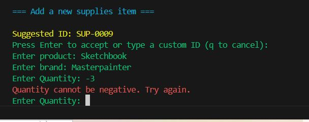 </td>
    </tr>
   <tr>
  <td><strong>Colour-Coded Feedback</strong></td>
  <td>
    Uses <code>colorama</code> to visually distinguish messages: 
    <strong>Blue:</strong> section titles and main menus 
    <strong>Yellow:</strong> menu options and warnings 
    <strong>Green:</strong> user prompts and input guidance 
    <strong>Red:</strong> errors and invalid input 
    <strong>Magenta:</strong> successful operations and cancellations 
    <strong>Cyan:</strong> table headers in search results
  </td>
  <td> 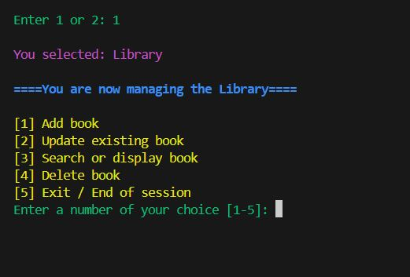  
  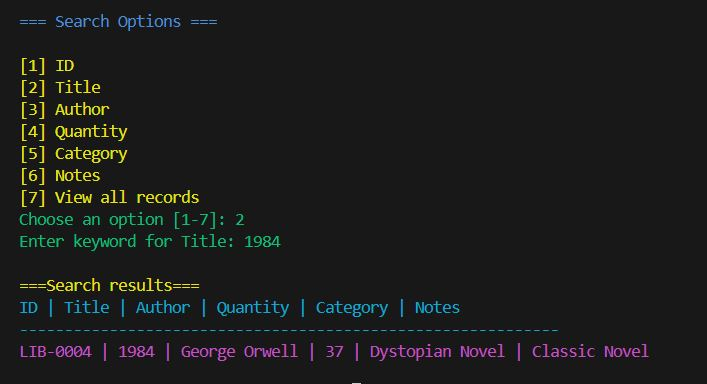
  </td>
</tr>
    <tr>
      <td><strong>Menu System</strong></td>
      <td>Shows how the program loops through menu options, handles user choices, and returns to the main menu safely after exiting a session. Demonstrates robust input handling and user guidance.</td>
      <td> 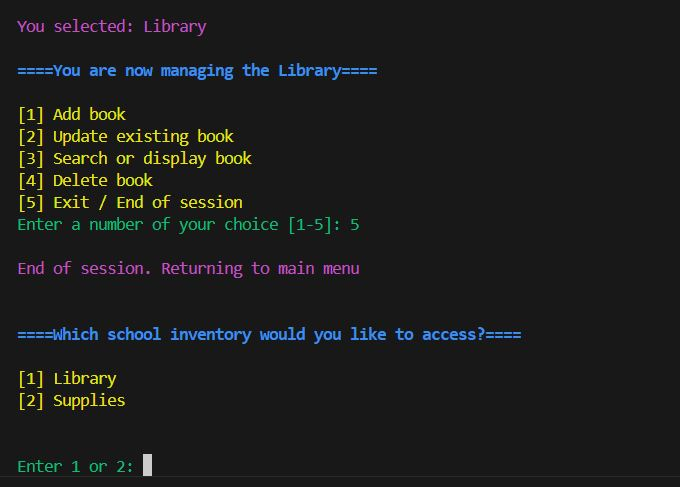 </td>
    </tr>
   <tr>
  <td><strong>Google Sheets Integration</strong></td>
  <td>Loads and updates inventory data from Google Sheets. All add, update, and delete operations are synchronized with the cloud sheet, ensuring persistent storage and real-time data consistency across sessions.</td>
  <td>
    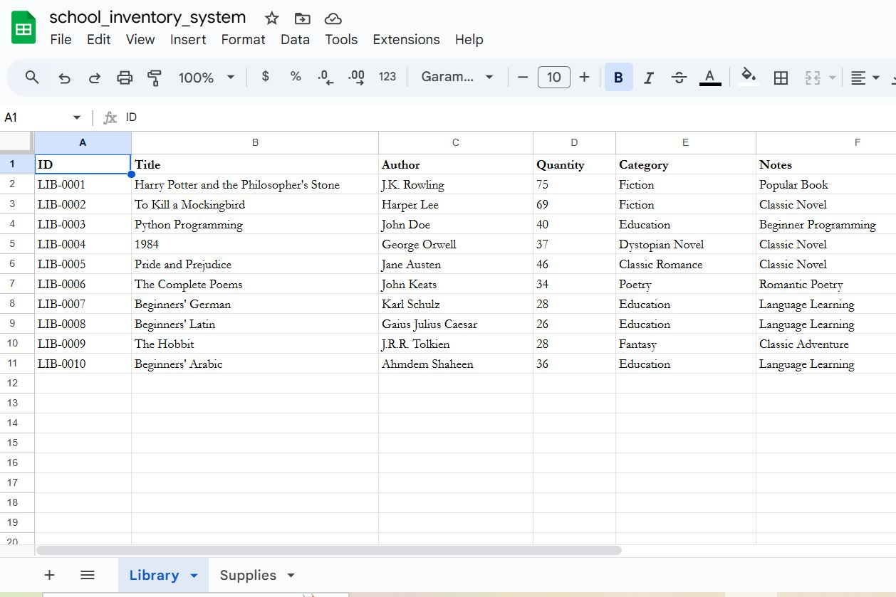  
    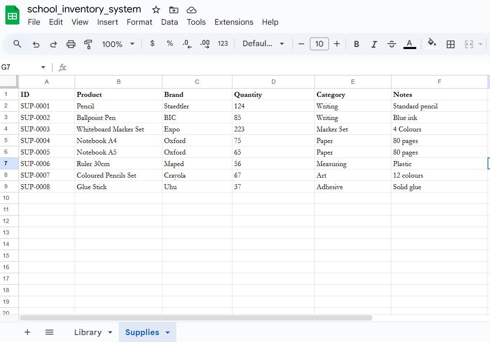
  </td>
</tr>
</tbody>
</table>
