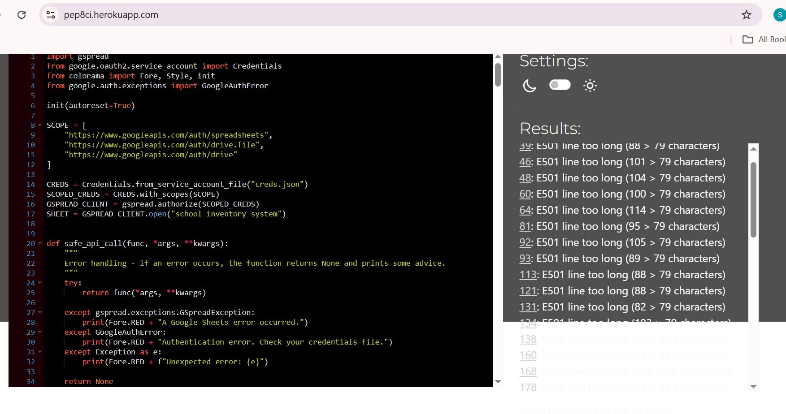
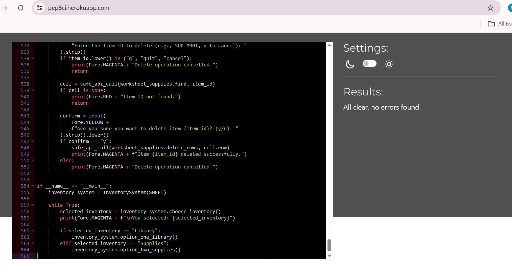

# school inventory (Link will follow)

Student: Sascha Klement

The inventory system is a comprehensive data processing and automation tool designed to assist a wide range of schools in managing, facilitating, and accelerating specific administrative and operational tasks, such as maintaining library records or handling supplies. It empowers school staff to add, update, search, display, or delete items from the respective records efficiently. As an international teacher, I understand that these tasks are crucial for the smooth day-to-day functioning of a school, which is often shaped by a multi-factorial set of dynamic conditions requiring staff to respond quickly and effectively to a variety of challenges. Therefore, automating key services and functionalities within such a fast-paced environment is essential to a school’s overall operational success and, ultimately, to the pupils it serves, particularly in the context of international education where adaptability and efficiency are of heightened importance.

# User Experience

## Background, Planning and Purpose:

The school inventory system provides staff with a clear and user-friendly way to automate recurring tasks such as managing library records and tracking supplies. By reducing the administrative load, teachers and administrators are able to devote more time to planning, instruction, and direct student support. With accurate data at hand, tasks such as monitoring stock levels, identifying missing items, calculating costs, and planning future purchases become far more manageable. Users can take informed decisions based on quantified, up-to-date information rather than memory or guesswork.

When planning this project, I wanted users to be able to:

* add, update, search, display and delete existing items,

* monitor product usage,

* make informed decisions about restocking, and

* access clear, colour-coded information for both library materials and general supplies.

Although a wide range of commercial school management systems exist, many of them are costly, overly complex for smaller institutions, or simply beyond the budget of schools with limited resources. My aim was to create a lightweight, low-cost data-automation tool that allows schools to benefit from basic digital management without requiring significant financial investment. Such an in-house solution can save time, reduce errors, and act as an accessible first step towards adopting more sophisticated digital systems in the future.

My own experience working across a variety of schools in Egypt made it clear that budget restrictions and, at times, hesitation toward new technologies can hinder more efficient organisational practices. This project is therefore designed as a practical, scalable solution that bridges that gap.

# User Stories:

Inventory Management  
As a staff member of a school, I want to utilise technology to manage library and supply records, so that I can dedicate more time to planning and teaching.

Intuitive Interface  
As a staff member of a school, I want the software to be user-friendly and easy to navigate, so that I can operate it independently without extensive training.

Automated ID Suggestions  
As a staff member of a school, I want the programme to suggest unique product IDs for new items, so that I do not have to assign them manually and risk duplication.

Colour-Coded Feedback  
As a staff member of a school, I want important information and messages to be colour-coded, so that I can quickly identify the programme’s responses and functionality.

Add Inventory Items  
As a staff member of a school, I want to add new books or supplies to the inventory, so that I can maintain accurate records of all items.

Update Records  
As a staff member of a school, I want to update existing records, so that I can reflect restocking or changes in item details.

Search and Display Items  
As a staff member of a school, I want to search for and display existing records, so that I can access up-to-date information about the school’s inventory.

Delete Items  
As a staff member of a school, I want to delete obsolete or unused items from the records, so that the inventory remains relevant and uncluttered.

Error Handling  
As a staff member of a school, I want the programme to handle errors gracefully, so that I can rely on it without causing crashes or data loss.

# Programme Features
 

<h2>Existing Features</h2>

<table>
  <thead>
    <tr>
      <th>Feature</th>
      <th>Notes</th>
      <th>Screenshot</th>
    </tr>
  </thead>
  <tbody>
    <tr>
      <td><strong>Select Inventory Type</strong></td>
      <td>Upon starting, staff choose between managing <strong>Library items</strong> or <strong>Supplies</strong>. This determines which dataset the following actions will affect.</td>
      <td> </td>
    </tr>
    <tr>
      <td><strong>Add Item</strong></td>
      <td>Allows staff to add new books or supplies with suggested unique IDs. Validates quantity as a non-negative integer and ensures no duplicate names or IDs exist.</td>
      <td>   
       </td>
    </tr>
    <tr>
      <td><strong>Update Item</strong></td>
      <td>Staff can update existing records by ID. Current values are displayed, allowing selective edits. Quantity validation ensures non-negative integers.</td>
      <td>   
      </td>
    </tr>
    <tr>
      <td><strong>Search / Display Records</strong></td>
      <td>Staff can search by various columns or display all items. Search results are color-coded for readability and handle empty results gracefully.</td>
      <td>   
      
      </td>
    </tr>
    <tr>
      <td><strong>Delete Item</strong></td>
      <td>Removes items by ID with a confirmation prompt. Cancelling or invalid IDs are handled safely to prevent accidental deletions.</td>
      <td>  
      
      </td>
    </tr>
    <tr>
      <td><strong>Input Validation</strong></td>
      <td>Validates numeric fields (quantity), unique IDs, and prevents duplicates. Ensures data integrity and prevents crashes. Pars pro toto, the following screenshot demonstrates the handling of a negative quantity input.</td>
      <td>  </td>
    </tr>
   <tr>
  <td><strong>Colour-Coded Feedback</strong></td>
  <td>
    Uses <code>colorama</code> to visually distinguish messages: 
    <strong>Blue:</strong> section titles and main menus 
    <strong>Yellow:</strong> menu options and warnings 
    <strong>Green:</strong> user prompts and input guidance 
    <strong>Red:</strong> errors and invalid input 
    <strong>Magenta:</strong> successful operations and cancellations 
    <strong>Cyan:</strong> table headers in search results
  </td>
  <td>   
  
  </td>
</tr>
    <tr>
      <td><strong>Menu System</strong></td>
      <td>Shows how the program loops through menu options, handles user choices, and returns to the main menu safely after exiting a session. Demonstrates robust input handling and user guidance.</td>
      <td>  </td>
    </tr>
   <tr>
  <td><strong>Google Sheets Integration</strong></td>
  <td>Loads and updates inventory data from Google Sheets. All add, update, and delete operations are synchronized with the cloud sheet, ensuring persistent storage and real-time data consistency across sessions.</td>
  <td>
      
    
  </td>
</tr>
</tbody>
</table>

# Future Additions and Implementations
 

<h2>Future Enhancements</h2>

<table>
  <thead>
    <tr>
      <th>Planned Feature</th>
      <th>Description</th>
    </tr>
  </thead>
  <tbody>
    <tr>
      <td><strong>Additional Inventory Modules</strong></td>
      <td>Extend the system beyond Library and Supplies to include Personnel, Student Marks, School Buses/Transport, and other school-related inventories such as ICT equipment or lab materials.</td>
    </tr>
    <tr>
      <td><strong>User Authentication & Role Management</strong></td>
      <td>Implement login and session handling with role-based access (e.g., admin vs teacher). Restrict sensitive operations such as deletion or bulk updates to authorised roles only.</td>
    </tr>
    <tr>
      <td><strong>Advanced Search & Filtering</strong></td>
      <td>Add powerful search tools to filter by ID ranges, names, quantity levels, price ranges, or categories. Improve navigation with flexible user-defined filters.</td>
    </tr>
    <tr>
      <td><strong>Low Stock Alerts</strong></td>
      <td>Automatically detect when items fall below a threshold and notify users with warnings, prompts, or optional email notifications.</td>
    </tr>
    <tr>
      <td><strong>Bulk Import & Export</strong></td>
      <td>Enable batch operations such as adding or updating items via CSV or Excel import. Allow exporting entire inventories or selected categories for offline analysis.</td>
    </tr>
    <tr>
      <td><strong>Transaction History & Audit Trail</strong></td>
      <td>Track all Add/Update/Delete actions with timestamps, previous values, new values, and the user responsible. Useful for transparency and debugging.</td>
    </tr>
    <tr>
      <td><strong>Reports & Document Export</strong></td>
      <td>Generate structured reports (inventory summaries, low-stock reports, value insights) and export them to PDF or CSV for printing or record-keeping.</td>
    </tr>
    <tr>
      <td><strong>Data Visualisation</strong></td>
      <td>Include charts such as stock level graphs, category breakdowns, price trends, or usage statistics. Useful for admin-level decision-making.</td>
    </tr>
    <tr>
      <td><strong>Multi-Location Inventory Support</strong></td>
      <td>Track items across multiple stores, rooms, or school buildings. Allow switching between locations or aggregating totals across the campus.</td>
    </tr>
    <tr>
      <td><strong>Price History & Cost Tracking</strong></td>
      <td>Record changes to item cost over time and generate analytics for budgeting, forecasting, and financial reporting.</td>
    </tr>
    <tr>
      <td><strong>Mobile or Tablet Integration</strong></td>
      <td>Create a mobile-friendly app or web interface to allow on-the-go inventory updates, barcode scanning, or quick checks while moving around the school.</td>
    </tr>
    <tr>
      <td><strong>Automation & System Integration</strong></td>
      <td>Add scheduled backups, cloud sync, or integration with Google Workspace. Potential for barcode/QR scanning and API-based communication with other school systems.</td>
    </tr>
  </tbody>
</table>

# Technologies behind the 'School Inventory' programme:
 

<h2>Tools & Technologies</h2>

<table>
  <thead>
    <tr>
      <th>Tool / Technology</th>
      <th>Use</th>
    </tr>
  </thead>
  <tbody>
    <tr>
      <td>Git</td>
      <td>Version control for tracking changes in code (git add, commit, push).</td>
    </tr>
    <tr>
      <td>GitHub</td>
      <td>Secure online repository for code storage, collaboration, and version tracking.</td>
    </tr>
    <tr>
      <td>Visual Studio Code</td>
      <td>Local development environment for writing, debugging, and running code.</td>
    </tr>
    <tr>
      <td>Python</td>
      <td>Main programming language used for the inventory system.</td>
    </tr>
    <tr>
      <td>Heroku</td>
      <td>Hosting and deployment of the back-end site to make the application accessible online.</td>
    </tr>
    <tr>
      <td>ChatGPT</td>
      <td>Assistance with coding, debugging, explanations, and improving code logic.</td>
    </tr>
    <tr>
      <td>Google Sheets</td>
      <td>Data storage and synchronization for the inventory database.</td>
    </tr>
  </tbody>
</table>

# Programme Design

## Data Model
### Classes & Functions

The School Inventory System is built using an object-oriented and modular design to keep the code maintainable and extendable. The main structure revolves around the `InventorySystem` class, which manages access to two subsystems: **Library** and **Supplies**.  

Data persistence is handled via **Google Sheets**, with each subsystem stored in a separate worksheet.

---

### InventorySystem Class

The `InventorySystem` class encapsulates all core functionality, including:

- Selecting which inventory to manage (Library or Supplies).  
- Adding, updating, searching, displaying, and deleting records.  
- ID generation with gap-filling and validation.  
- Error handling for Google Sheets API and authentication issues.  

#### Key Attributes:

- `sheet`: The Google Sheets object connected to the `school_inventory_system` workbook.

#### Core Methods:

- **choose_inventory()** – Displays the main inventory menu and lets the user choose between Library or Supplies.  
- **_search_record(worksheet, headers)** – Generic search function for both Library and Supplies; supports column-based keyword searches and displays results in a formatted table.  
- **_generate_suggested_id(prefix, worksheet)** – Suggests the next available ID, filling gaps in the sequence automatically.  
- **_ask_for_id_with_suggestion(prefix, worksheet)** – Displays suggested ID, validates user input, and prevents duplicates.  

#### Library Methods:

- **option_one_library()** – Displays the Library menu and handles task selection: add, update, search/display, delete, or exit.  
- **add_book()** – Prompts for book details (ID, title, author, quantity, category, notes) and appends to Google Sheets.  
- **update_book()** – Allows updating an existing book by ID; validates quantity and preserves unchanged fields.  
- **search_book()** – Uses `_search_record` to search or display Library records.  
- **delete_book()** – Deletes a book from the Library worksheet after confirmation.  

#### Supplies Methods:

- **option_two_supplies()** – Displays the Supplies menu and handles task selection.  
- **add_item()** – Prompts for item details (ID, product, brand, quantity, category, notes) and appends to Google Sheets.  
- **update_item()** – Allows updating an existing item by ID; validates quantity and preserves unchanged fields.  
- **search_item()** – Uses `_search_record` to search or display Supplies records.  
- **delete_item()** – Deletes an item from the Supplies worksheet after confirmation.  

---

### Error Handling

All Google Sheets operations are wrapped in `safe_api_call(func, *args, **kwargs)` to gracefully handle:

- API exceptions (`gspread.exceptions.GSpreadException`)  
- Authentication errors (`GoogleAuthError`)  
- Any other unexpected runtime errors  

Errors are displayed with colored terminal messages using **colorama** for clarity.

---

### Imports / Dependencies

The project uses the following packages:

- **gspread** – Connects and interacts with Google Sheets.  
- **google.oauth2.service_account** – Authenticates via service account.  
- **colorama** – Adds colored terminal output.  
- **google.auth.exceptions** – Handles authentication-specific errors.  

This structure makes the system **scalable**, **maintainable**, and **ready for future enhancements**, such as adding new inventory modules, automated reporting, or mobile integration. 
 

# Testing

## Code Validation

In order to test my programme (run.py), I used the recommended [Code Institute Python Validator](https://pep8ci.herokuapp.com/).

<table border="1" cellspacing="0" cellpadding="5">
  <thead>
    <tr>
      <th></th>
      <th>File</th>
      <th>Screenshot</th>
      <th>Notes</th>
    </tr>
  </thead>
  <tbody>
    <tr>
      <td>Before</td>
      <td>run.py (original)</td>
      <td></td>
      <td>Long lines, minor formatting issues</td>
    </tr>
    <tr>
      <td>After</td>
      <td>run.py (PEP8-compliant)</td>
      <td></td>
      <td>Lines shortened, whitespace corrected, PEP8-compliant</td>
    </tr>
  </tbody>
</table>
 

# Bugs

As I built the project step by step, I tried to eliminate potential bugs on the go. Luckily, my code never broke or crashed, but I instinctively felt this was down to luck rather than design. It was a bit like writing a book chapter based on anecdotal evidence—fine for a first draft, but not for publication (as a published author, I have been through this process myself). This is why I decided to implement the `safe_api_call()` function for error handling and ensured it was called whenever the program fetched from or pushed data to Google Sheets. This approach helps prevent crashes and provides clear feedback to the user in case of unexpected issues.

## Potential Bugs / Issues

During testing, no bugs were observed. The program was thoroughly tested using:

- All menu options (Library and Supplies)
- Adding, updating, deleting, and searching records
- Edge cases (e.g., negative numbers, empty input, invalid IDs)
- Google Sheets integration for persistent data

Potential issues that were considered and mitigated include:

- Duplicate item IDs and names
- Invalid numeric input (negative quantity or non-integer values)
- Failed Google Sheets API calls (handled with clear error messages)
- User-cancelled operations (handled gracefully)

## Test Results

<table border="1" cellpadding="5" cellspacing="0">
  <thead>
    <tr>
      <th>Test Scenario</th>
      <th>Expected Result</th>
      <th>Actual Result</th>
    </tr>
  </thead>
  <tbody>
    <tr>
      <td>Add new library book</td>
      <td>Book added and visible in sheet</td>
      <td>Success</td>
    </tr>
    <tr>
      <td>Update existing supplies item</td>
      <td>Item updated in sheet</td>
      <td>Success</td>
    </tr>
    <tr>
      <td>Search for non-existent item</td>
      <td>Shows "No matching records found"</td>
      <td>Success</td>
    </tr>
    <tr>
      <td>Enter negative quantity</td>
      <td>Program prevents entry and prompts again</td>
      <td>Success</td>
    </tr>
  </tbody>
</table>
